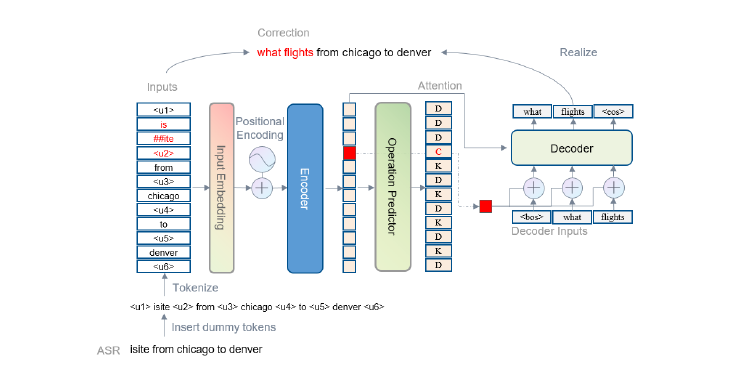

# ConstDecoder

This repository is the implementation of [ASR Error Correction with Constrained Decoding on Operation Prediction.](https://arxiv.org/abs/2208.04641)


## Requirements

To install python environment, please execute:    
```shell
conda create -n constdecoder python==3.7
conda activate constdecoder
```

To install python related packages, please execute:     
```shell
pip install -r requirements.txt
```
## Datasets and Preprocessing
ATIS, SNIPS, TOP are used in our experiment, and you need to download and then reformat them. **Note**: Due to internal policy, the reprocessing TOP dataset will not be released.

**ATIS**

Download the [atis.zip](https://github.com/Observeai-Research/Phoneme-BERT/raw/main/phomeme-bert-data/downstream-datasets/atis.zip), and put it into the `datasets/` directory.    
Execute `python preprocess_atis.py` under the `datasets/` directory.


**SNIPS**

Create `snips_tts_asr` directory by executing `mkdir -p datasets/snips_tts_asr/`    
Download the [train.supconf.csv](https://raw.githubusercontent.com/MiuLab/SpokenVec/master/data/snips_tts_asr/train.supconf.csv), [valid.supconf.csv](https://github.com/MiuLab/SpokenVec/raw/master/data/snips_tts_asr/valid.supconf.csv), and [test.supconf.csv](https://raw.githubusercontent.com/MiuLab/SpokenVec/master/data/snips_tts_asr/test.supconf.csv) and put them into the `datasets/snips_tts_asr/` directory.    
Execute `python preprocess_snips.py` under the `datasets/` directory.


## Pretrained Models

You need to download the pretrained models [bert-base-uncased](https://huggingface.co/bert-base-uncased), and put it in your `PRETRAINED_MODEL` directory.

## Training

You can train your own model by executing:    
**ATIS**
```shell
cd models/ConstDecoder/scripts/
sh run_train_atis.sh
```
**SNIPS**
```shell
cd models/ConstDecoder/scripts/
sh run_train_snips.sh
```
## Evaluation

You can test your own model by executing:    
**ATIS**
```shell
cd models/ConstDecoder/scripts/
sh run_eval_atis.sh
```
**SNIPS**
```shell
cd models/ConstDecoder/scripts/    
sh run_eval_snips.sh
```
## Citation

If you use our code in your research, you can cite our paper.
```
@article{DBLP:journals/corr/abs-2208-04641,
  author    = {Jingyuan Yang and
               Rongjun Li and
               Wei Peng},
  title     = {{ASR} Error Correction with Constrained Decoding on Operation Prediction},
  journal   = {CoRR},
  volume    = {abs/2208.04641},
  year      = {2022},
  url       = {https://doi.org/10.48550/arXiv.2208.04641},
  doi       = {10.48550/arXiv.2208.04641},
  eprinttype = {arXiv},
  eprint    = {2208.04641},
  timestamp = {Tue, 16 Aug 2022 16:44:57 +0200},
  biburl    = {https://dblp.org/rec/journals/corr/abs-2208-04641.bib},
  bibsource = {dblp computer science bibliography, https://dblp.org}
}
```

Also, if you you use ATIS, SNIP or TOP dataset, you'd better cite them accordingly.
```
@article{sundararaman2021phoneme,
	  title={Phoneme-BERT: Joint Language Modelling of Phoneme Sequence and ASR Transcript},
	  author={Sundararaman, Mukuntha Narayanan and Kumar, Ayush and Vepa, Jithendra},
	  journal={arXiv preprint arXiv:2102.00804},
	  year={2021}
	}
```
```
 @inproceedings{
        9054689,
        author={C. {Huang} and Y. {Chen}},
        booktitle={ICASSP 2020 - 2020 IEEE International Conference on Acoustics, Speech and Signal Processing (ICASSP)}, 
        title={Learning Asr-Robust Contextualized Embeddings for Spoken Language Understanding}, 
        year={2020},
        volume={},
        number={},
        pages={8009-8013},
    }
```
```
@ARTICLE {
    author  = "Sonal Gupta and Rushin Shah and Mrinal Mohit and Anuj Kumar and Michael Lewis",
    title   = "Semantic Parsing for Task Oriented Dialog using Hierarchical Representations",
    journal = "Conference on Empirical Methods in Natural Language Processing (EMNLP)",
    year    = "2018",
    month   = "Oct"
}
```
## License
ConstDecoder has a BSD-style license, as found in the [LICENSE](LICENSES/LICENSE) file.

